# IOS XE Programmability Lab
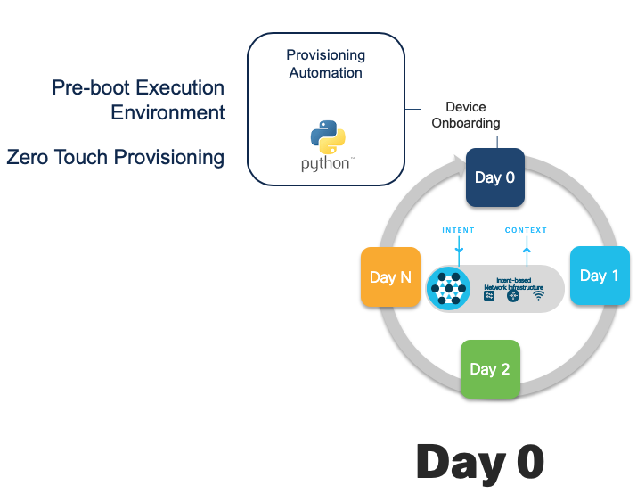
# Zero Touch Provisioning
Introduction to ZTP: In this module, you will verify and confirm the prerequisites for ZTP, the Zero Touch Provisioning feature of IOS XE on the Catalyst 9300 switch. At the end of this module, you will issue the 'write erase' command, reload the switch, and watch as the ZTP process completes and the switch is configured programmatically and automatically.

# Getting Started

Connect to the Remote Desktop Environment and use PuTTY to SSH into Ubuntu VM:


## _Step 1:_
**ZTP Python File:** Review the `ztp-simple.py` file on the Ubuntu VM which is located at `/var/www/html`. This file uses the Python API to set the interface IP address, configure credentials and enabled access to the device over the **NETCONF** and **RESTCONF** programmatic interfaces, as well as to configure some additional device features. On the Windows Jump Host desktop, double-click on the **Ubuntu** icon to open a PuTTY session.

> **auto@automation:~$** less /var/www/html/ztp-simple.py

**Note** : Python script with the VM POD environment may differ slightly

```Python
print "\n\n *** Sample ZTP Day0 Python Script *** \n\n"
# Importing cli module
import cli

print "Configure vlan interface, gateway, aaa, and enable netconf-yang\n\n"
cli.configurep(["int gi1/0/24","no switchport", "ip address 10.1.1.5 255.255.255.0", "no shut", "end"])
cli.configurep(["username admin privilege 15 secret 0 Cisco123"])
cli.configurep(["interface Loopback0", "ip address 192.168.12.1 255.255.255.0", "end"])
cli.configurep(["aaa new-model", "aaa authentication login default local", "end"])
cli.configurep(["aaa authorization exec default local", "aaa session-id common", "end"])
cli.configurep(["ntp server 10.1.1.3", "netconf-yang", "end"])
cli.configurep(["line vty 0 15", "transport input all", "exec-timeout 0 0", "end"])
cli.configurep(["ip scp server enable", "end"])
cli.configurep(["hostname C9300", "end"])
cli.configurep(["telemetry ietf subscription 101","encoding encode-kvgpb","filter xpath /process-cpu-ios-xe-oper:cpu-usage/cpu-utilization/five-seconds","stream yang-push","update-policy periodic 500","receiver ip address 10.1.1.3 57500 protocol grpc-tcp","end"])
cli.configurep(["ip http secure-server", "restconf", "end"])
cli.configurep(["iox", "end"])
print "\n\n *** Executing show ip interface brief  *** \n\n"
cli_command = "sh ip int brief"
cli.executep(cli_command)

print "\n\n *** ZTP Day0 Python Script Execution Complete *** \n\n"
```

## _Step 2:_
**IP:** The primary IP on the ens192 interface is 10.1.1.3, but a secondary IP is also assigned to this interface at 10.9.1.3. Use the ‘ip a’ command to check the IP has been assigned

Check the interface IP assignments:

> **auto@automation:~$** ip a
>
> **auto@automation:~$** ip a | grep 10.9.1.3

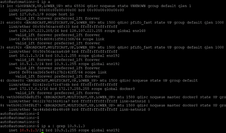

Here we see that the ens192 interface (#3) has the additional IP assigned of 10.9.1.3. This interface is only used to ZTP the IOS XE devices in the lab.


## _Step 3:_
**DHCP Server** : ZTP works when the DHCP server replies to the IOS XE client with DHCP option 67 in the DHCP Response. The DHCP server's configuration file is called `dhcpd.conf` and it is located in the `/etc/dhcp/` folder. It specifies the IP range to server DHCP leases onto, as well as the Python file that the device will download and executed as part of the `option bootfile-name` a.k.a `option 67`.

Examine the DHCP server configuration:

>**auto@automation:~$** cat /etc/dhcp/dhcpd.conf


If any changes are made to the configure file, then restart the service with the command below.

> **auto@automation:~$** sudo /etc/init.d/isc-dhcp-server restart

Check the status of the DHCP service to ensure it is running correctly

> **auto@automation:~$** sudo /etc/init.d/isc-dhcp-server status

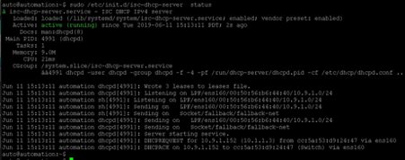

## _Step 4:_
**Webserver** : The Apache webserver is used to server the Python file to the IOS XE switch as part of the ZTP process.

Check the status of the Apache webserver to ensure it is running correctly

> **auto@automation:~$** sudo /etc/init.d/apache2 status

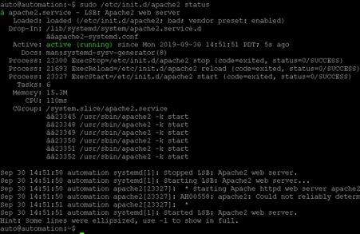

Check the configuration for the Apache webserver. This shows which folder the `DocumentRoot` is – this is the location where the Python file should be stored

> **auto@automation:~$* cat /etc/apache2/sites-enabled/000-default.conf | grep -v \#

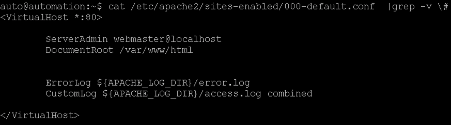

If any changes are required to the Apache webserver configuration file, or if the service needs to be restart then run the following commands:

> **auto@automation:~**$ sudo /etc/init.d/apache2 restart

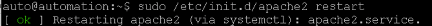


## _Step 5:_
**IOS XE Device:** Now the prerequisites for ZTP are met and the device is ready to be reloaded once any previous configuration is removed – this is to ensure that the Day0 ZTP process is initialized once the switch boots. This emulates a new, un-configured device that is ready to "ZTP'd"

Click the `C9300 putty` icon on the Windows jump host desktop. Erase the configuration and reload the device

This process will take about 6 minutes to successfully complete. Once completed, ICMP pings from the device will begin responding.

> **C9300# wr**

> **C9300# wr erase**

> **C9300# reload**

If prompted to save the configuration, enter `no`

Press enter to confirm reloading

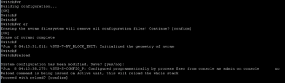

The device will reload and once IOS XE boots up, the ZTP process will start. The device will obtain the ztp.py configuration file from the Ubuntu server that it receives in the DHCP response.

During this time, the DHCP and HTTP server logs can be followed, and progress can be tracked as the device boots completes the ZTP process. In this case, we see first the DHCP server providing the `DHCPOFFER` to the device, and next the `GET` requests to the `HTTP` server (from the device at `IP 10.9.1.154`) that accesses and executes the `ztp-simply.py` script:

> **auto@automation:~$** cd ; sh watch\_ztp\_logs.sh

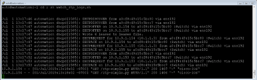

You may also start a ping to watch when the interface on the devices comes back online. Open another ubuntu terminal and ping the switch.

> **auto@automation:~$** ping 10.1.1.5

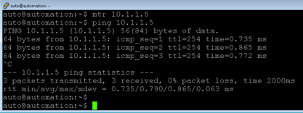

**Serial Console:** Connect to the serial console from the Ubuntu VM. Use the helper command `$ consolepodXX` (where XX is your pod #). If there is a problem with the ZTP process (either the python file, the webserver, the DHCP server, or if it's just taking a long time and you want to watch the device boot up) then the serial console can be used to understand why the device does not complete the ZTP process successfully and come back online fully configured. 

Use Putty to connect to the serial port with the below as a template:

Be sure to enter the correct pod number for example: `consolepod15` or `consolepod02`

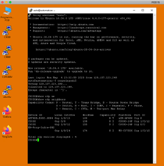

Example output from the serial console that shows successful ZTP and Python file execution:

The ZTP process will stop if there is input detected on the serial console – do not send any input characters or keys during the day0 process

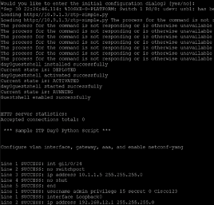


## _Conclusion_
The Cisco Catalyst 9300 switch has now successfully completed the Zero Touch Provisioning process and is fully configured on the network. Because of the pre-configuration within the ztp-simple.py file, all use cases for the related IOS XE Programmability Lab have been enabled. Specifically, the switch has an IP, user, and SSH access enabled, and the programmatic NETCONF and RESTCONF interfaces have also been configured and enabled.